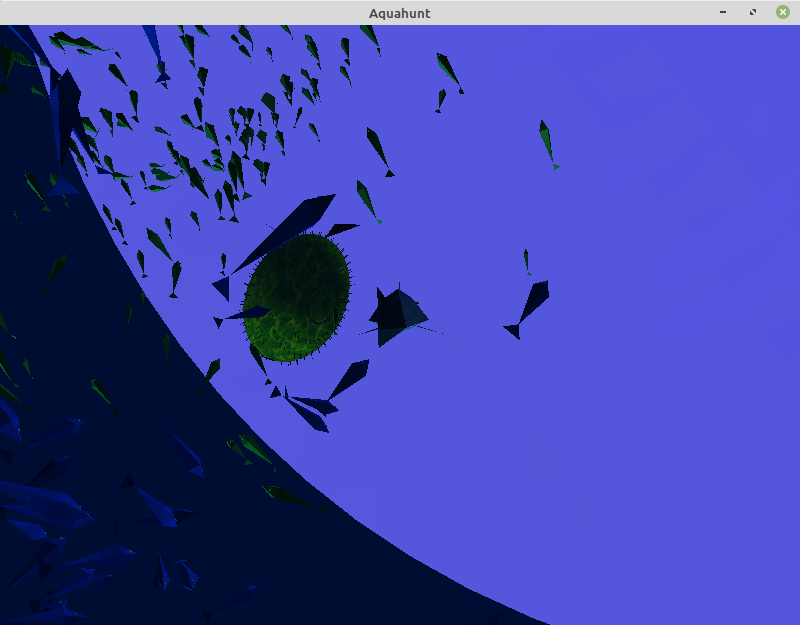
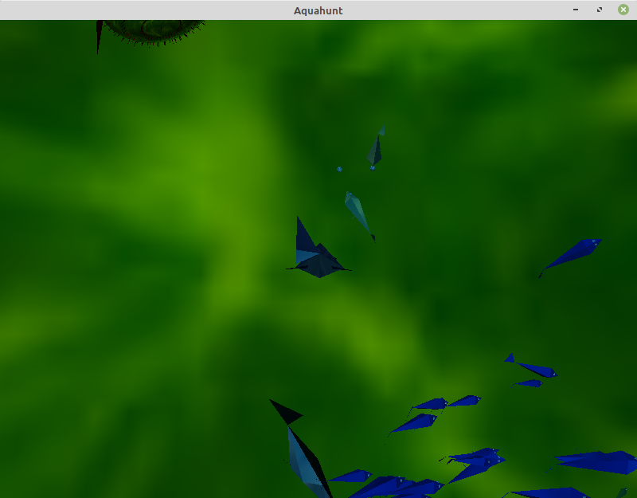

# Aquahunt 
### v1.0.0
Fish food chain simulation.

### Rules:
- 400 Green fishes:
    - Eat phytoplankton (not rendered) in the middle of ocean
    - Run away from the closest blue fish or shark
    - Mass: random sample from normal distribution with average 4 and stardard deviation 1
    - Size: random sample from normal distribution with average 9 and stardard deviation 2
    - Max speed: random sample from normal distribution with average 50 and stardard deviation 10

- 150 Blue fishes:
    - Eat green fishes (accelerate towards the closest)
    - Run alway from the closest shark or whale
    - Mass: random sample from normal distribution with average 10 and stardard deviation 4
    - Size: random sample from normal distribution with average 18 and stardard deviation 4
    - Max speed: random sample from normal distribution with average 65 and stardard deviation 15
- 1 Shark:
    - Eat green fishes (accelerate towards the closest)
    - Run alway from the closest shark or whale
    - Mass: 20
    - Size: 60
    - Max speed: 300
- 5 Whales:
    - Eat blue fishes (accelerate towards the closest)
    - Mass: random sample from normal distribution with average 30 and stardard deviation 15
    - Size: random sample from normal distribution with average 108 and stardard deviation 10
    - Max speed: random sample from normal distribution with average 400 and stardard deviation 100

- 1 Puffer fish
    - Not involved in the food chain, travel randomly
    - Grows and shinks with time
    - Colision with other fish paralize them
    - Mass: 300
    - Size: 100
    - Max speed: 100

- 2 Lantern fish:
    - Not involved in the food chain, travel randomly
    - You can lighten up or turn off their lights with f3 and f4
    - Mass: 30
    - Size: 30
    - Max speed: 150

### Instructions

On Linux, install freeglut3-dev: `sudo apt-get install freeglut3-dev`

Compile with: `gcc aquahunt.cpp -L/usr/lib -L/usr/X11R6/lib -lX11 -lGL -lGLU -lglut -ljpeg -lm -lstdc++ -o aquahunt`

This is going to generate the file aquahunt. Then run it with `./aquahunt`

## Screenshots

## Bug Reports & Feature Requests

You can help by reporting bugs, suggesting features, reviewing feature specifications or just by sharing your opinion.

Use [GitHub Issues](https://github.com/JonathanAlis/aquahunt/issues) for all of that.

## Contributing

1. Fork the project.
2. Create a branch for your new feature.
3. Write tests.
4. Write code to make the tests pass.
5. Submit a pull request.

All pull requests are welcome !

## License

CountPages uses the MIT license. See [LICENSE](https://github.com/JonathanAlis/aquahunt/blob/master/LICENSE) for more details.
